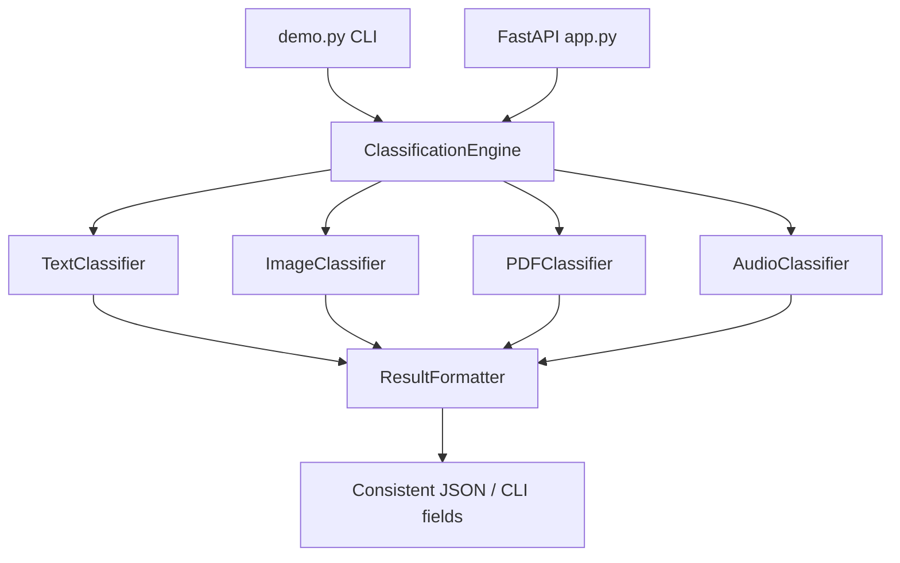

# Unified Classification Engine

Reusable Python classification engine with CLI and FastAPI entry points for text, image, PDF, and audio inputs.

## Installation

```powershell
cd C:\Users\Ashwini Wadekar\OneDrive\Desktop\UnifiedClassificationEngine
python -m venv .venv
.\.venv\Scripts\Activate.ps1
pip install -r requirements.txt
python scripts\generate_samples.py
```

Optional heavy AI models are disabled by default for reliable local and Docker execution. To opt in:

```powershell
$env:UCE_ENABLE_OPTIONAL_MODELS="1"
```

## Folder Structure

```text
app.py                         FastAPI REST API
demo.py                        CLI demo for all classifiers
src/engine.py                   Reusable orchestration engine
src/classifiers/                Text, image, PDF, and audio classifiers
src/helpers/                    Result formatting, logging, dependency checks
examples/                       Sample txt, jpg, pdf, wav inputs
scripts/generate_samples.py     Regenerates sample inputs
scripts/verify_api.py           Verifies every API endpoint
docs/                           Runtime, API, testing, architecture docs
review_packets/                 Submission evidence notes
review_code_packets/            Code review evidence notes
screenshots/                    Screenshot capture instructions/placeholders
```

## Execution Steps

Run the CLI demo:

```powershell
python demo.py
```

Run tests:

```powershell
python -m unittest discover -s tests -p "test_*.py"
```

Start the API:

```powershell
python app.py
Then open:

http://localhost:8000/docs
```

Verify API endpoints in another terminal:

```powershell
python scripts\verify_api.py
```

Run with Docker:

```powershell
docker compose up --build
```

## API Examples

```powershell
curl http://localhost:8000/health
curl http://localhost:8000/version
curl -X POST http://localhost:8000/classify/text -F "text=Hello from the classifier"
curl -X POST http://localhost:8000/classify/image -F "file=@examples/sample.jpg"
curl -X POST http://localhost:8000/classify/pdf -F "file=@examples/sample.pdf"
curl -X POST http://localhost:8000/classify/audio -F "file=@examples/sample.wav"
```

## Architecture Diagram



## AI Models

- Text: optional Hugging Face transformer plus keyword/entity fallback.
- Image: optional EasyOCR and object detection plus metadata/fallback classification.
- PDF: optional direct text extraction with pypdf, OCR fallback path, and heuristic classification.
- Audio: optional faster-whisper transcription with transcript classification fallback.

## Dependencies

Core dependencies are listed in `requirements.txt`. Optional model loading is controlled by `UCE_ENABLE_OPTIONAL_MODELS`; when unavailable or disabled, classifiers still return valid predictions, confidence, explanations, model names, and processing time.

## Known Limitations

- Default local mode uses deterministic heuristic fallback classification for fast evaluation.
- Audio sample is silent, so it demonstrates audio pipeline execution rather than speech content recognition.
- Optional OCR/speech/model quality depends on installed native libraries and model availability.

## Future Improvements

- Add trained domain-specific model adapters.
- Persist model/version metadata in a deployment manifest.
- Add authentication/rate limiting for production API use.
- Add richer fixture files for benchmark-style evaluation.
