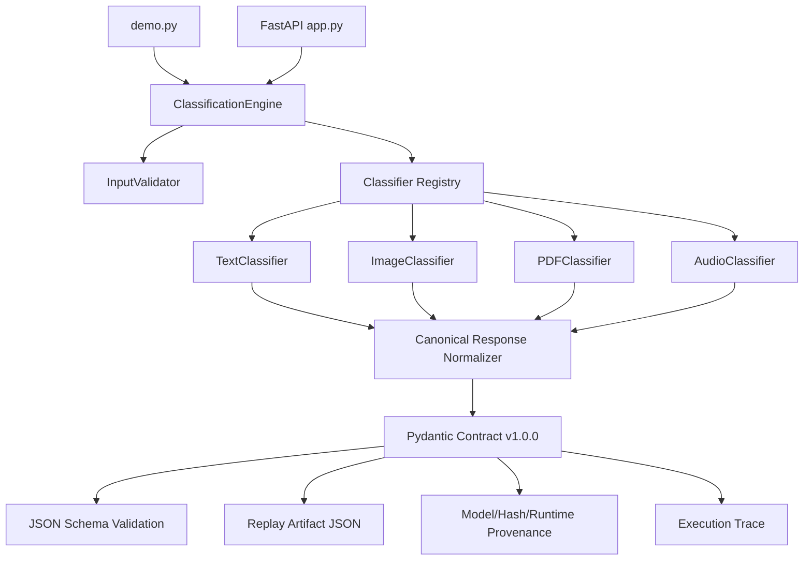

# Unified Classification Engine

Reusable Python classification engine with CLI and FastAPI entry points for text, image, PDF, and audio inputs. The existing architecture has been extended for **BHIV Test Task 3** with a canonical Pydantic classification contract, JSON Schema validation, replay artifacts, provenance metadata, execution traces, production error contracts, and contract compatibility checks.

## Installation

```powershell
cd "C:\Users\Ashwini Wadekar\OneDrive\Desktop\UnifiedClassificationEngine"
python -m venv .venv
.\.venv\Scripts\Activate.ps1
pip install -r requirements.txt
python scripts\generate_samples.py
```

Optional heavyweight AI model loading is disabled by default for reliable local execution. To enable installed optional model backends:

```powershell
$env:UCE_ENABLE_OPTIONAL_MODELS="1"
```

## Folder Structure

```text
app.py                         FastAPI REST API
demo.py                        CLI demo for all classifiers
src/engine.py                   Reusable orchestration engine
src/classifiers/                Text, image, PDF, and audio classifiers
contracts/                      Canonical Pydantic contract and error contract
validation/                     Input, output, and JSON Schema validation
versioning/                     Contract version and compatibility checker
provenance/                     Hashing and provenance metadata builders
trace/                          Execution trace generation
replay/                         Replay artifact writer and generated artifacts
schemas/                        Generated JSON Schema for contract v1.0.0
examples/                       Sample txt, jpg, pdf, wav inputs
docs/                           Runtime, API, testing, integration, architecture docs
review_packets/                 Engineering review evidence
review_code_packets/            Code review evidence
```

## Canonical Contract v1.0.0

All engine and API classification responses include the same canonical schema:

```text
success
contract_version
request_id
modality
input
output
provenance
trace
replay
metadata
error
```

Backward-compatible flat fields are still returned: `prediction`, `confidence`, `explanation`, `model_used`, `processing_time`, `category`, `summary`, `top_features`, and `processing_steps`.

The generated JSON Schema is stored at:

```text
schemas/classification_contract_v1.json
```

## Execution Steps

Run all four classifiers:

```powershell
python demo.py
```

Run tests:

```powershell
python -m unittest discover -s tests -p test_*.py
```

Verify API endpoints:

```powershell
python scripts\verify_api.py
```

Start API server:

```powershell
python app.py
```

Docker:

```powershell
docker compose up --build
```

## API Examples

```powershell
curl http://localhost:8000/health
curl http://localhost:8000/version
curl http://localhost:8000/schema
curl -X POST http://localhost:8000/classify/text -F "text=Hello from the contract"
curl -X POST http://localhost:8000/classify/image -F "file=@examples/sample.jpg"
curl -X POST http://localhost:8000/classify/pdf -F "file=@examples/sample.pdf"
curl -X POST http://localhost:8000/classify/audio -F "file=@examples/sample.wav"
```

## Architecture Diagram



## AI Models

- Text: optional Hugging Face transformer with deterministic heuristic fallback.
- Image: optional EasyOCR/object detection with image metadata fallback.
- PDF: pypdf metadata/text extraction with OCR-ready fallback path.
- Audio: optional faster-whisper transcription with transcript/fallback classification.

## Known Limitations

- Default local mode uses deterministic fallback paths unless `UCE_ENABLE_OPTIONAL_MODELS=1` is set.
- Audio sample is silent, so it verifies the audio pipeline rather than speech content quality.
- Docker runtime depends on Docker Desktop/CLI being available locally.

## Future Improvements

- Add domain-specific classifier adapters.
- Add contract migration tooling for future versions.
- Add replay comparison tooling for regression audits.
- Add production authentication and rate limiting.
