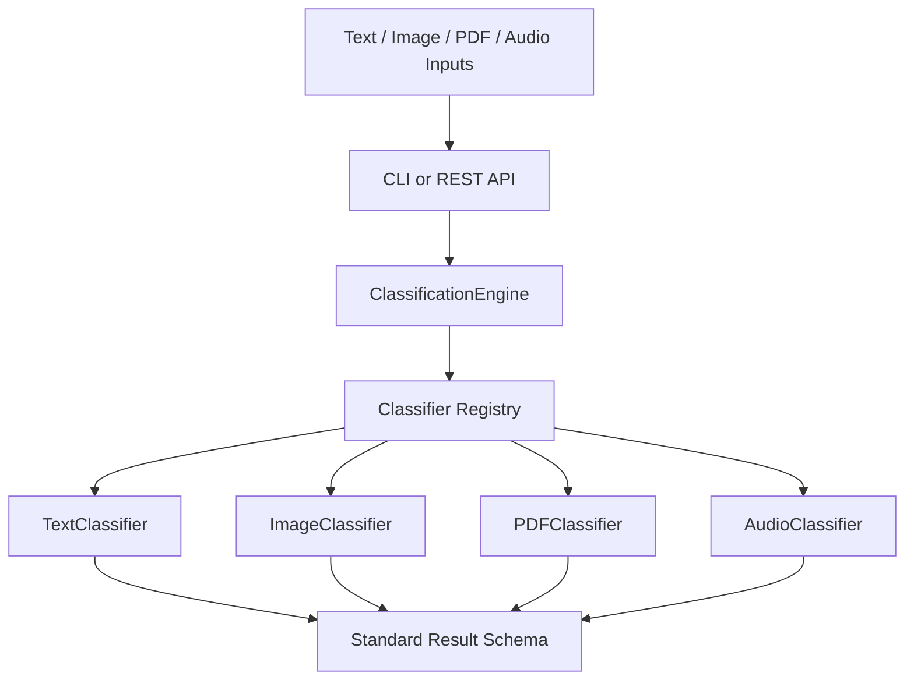

# Architecture

The project is organized around a reusable `ClassificationEngine`. Entry points such as the CLI and REST API call the engine instead of duplicating modality logic.

## Components

- `ClassificationEngine`: validates modality selection, dispatches classifiers, measures processing time, and returns consistent results.
- `BaseClassifier`: shared classifier interface.
- `TextClassifier`: text analysis and fallback prediction.
- `ImageClassifier`: image metadata, optional OCR/object detection, fallback prediction.
- `PDFClassifier`: PDF metadata/text extraction and fallback prediction.
- `AudioClassifier`: optional transcription and fallback prediction.
- `ResultFormatter`: common result payload builder.
- `DependencyChecker`: reports optional package availability without forcing imports.

## Design Notes

Optional heavy model loading is opt-in through `UCE_ENABLE_OPTIONAL_MODELS=1`. This keeps engineering evaluation deterministic and prevents startup failures when model artifacts or native dependencies are unavailable.
